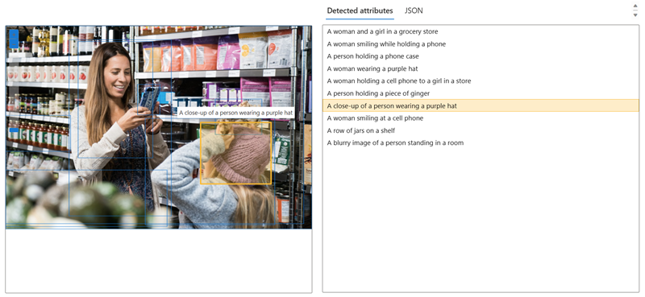

---
lab:
  title: Azure AI 파운드리 포털에서 이미지 분석
---

# Azure AI 파운드리 포털에서 이미지 분석

**Azure AI 비전**에는 이미지 콘텐츠와 컨텍스트를 이해하고 이미지에서 정보를 추출하기 위한 다양한 기능이 포함되어 있습니다. 이 연습에서는 지능형 애플리케이션을 만들기 위한 Microsoft의 플랫폼인 Azure AI 파운드리 포털의 Azure AI 비전을 사용하고 기본 제공 체험판 환경을 사용하여 이미지를 분석합니다. 

가상의 소매점인 *Northwind Traders*가 AI 서비스에서 매장을 모니터링하여 도움이 필요한 고객을 식별하고 직원에게 도움을 주도록 지시하는 "스마트 스토어"를 구현하기로 결정했다고 가정해 보겠습니다. Azure AI 비전을 사용하면 저장소 전체에서 카메라로 촬영한 이미지를 분석하여 묘사된 내용에 대한 의미 있는 설명을 제공할 수 있습니다.

## Azure AI 파운드리 포털에서 프로젝트 만들기

1. 웹 브라우저에서 [Azure AI 파운드리 포털](https://ai.azure.com)(`https://ai.azure.com`)을 열고 Azure 자격 증명을 사용하여 로그인합니다. 처음 로그인할 때 열리는 팁이나 빠른 시작 창을 닫습니다. 

1. 브라우저에서 `https://ai.azure.com/managementCenter/allResources`로 이동한 다음 **만들기**를 선택합니다. 그런 다음 새 *AI 허브 리소스*를 만드는 옵션을 선택합니다.

1. *프로젝트 만들기* 마법사에서 유효한 프로젝트 이름을 입력하고 기존 허브가 추천되면 *새* 허브를 만드는 옵션을 선택합니다. 

1. *고급 옵션*을 확장하여 프로젝트에 대한 다음 설정을 지정합니다.
    - **구독**: ‘Azure 구독’
    - **리소스 그룹**: 리소스 그룹을 만들거나 선택합니다
    - **지역**: 다음 위치 중 하나를 선택합니다.
        * 미국 동부
        * 프랑스 중부
        * 한국 중부
        * 서유럽
        * 미국 서부

    프로젝트와 허브가 생성될 때까지 기다립니다.

1. 프로젝트가 생성되면 프로젝트 세부 정보의 *개요* 페이지로 이동하게 됩니다. 왼쪽 메뉴에서 **AI 서비스**를 선택합니다(콘텐츠를 읽으려면 위쪽 아이콘을 클릭하여 메뉴를 확장해야 할 수도 있음). 

1. *AI 서비스* 페이지에서 *비전 + 문서* 타일을 선택하여 Azure AI 비전 및 문서 기능을 시도합니다.

    

## 이미지에 대한 캡션 생성

Azure AI 비전의 이미지 캡션 기능을 사용하여 *Northwind Traders* 스토어에서 카메라로 촬영한 이미지를 분석해 보겠습니다. 이미지 캡션은 **캡션** 및 **조밀 캡션** 기능을 통해 사용할 수 있습니다.

1. *비전 + 문서* 페이지에서 아래로 스크롤하여 *다른 모든 비전 기능 보기*에서 **이미지**를 선택합니다. 그런 다음 **이미지 캡션** 타일을 선택합니다.

    

1. **이미지에 캡션 추가** 페이지에서 생성한 *Azure AI 서비스* 리소스를 선택합니다. 

1. **이미지에 캡션 추가하기** 페이지에서 **사용해 보기** 부제 아래에 나열된 연결된 리소스를 검토합니다. 변경할 필요가 없습니다. (*참고*: 리소스 생성 중에 이전에 유효한 리소스 위치를 사용자 지정하지 않은 경우, 유효한 지역에 있는 새 Azure AI 서비스 리소스를 생성하라는 메시지가 표시될 수 있습니다. 랩을 계속하려면 새 리소스를 만들어야 합니다.)  

1. **image-analytic.zip**을 다운로드하려면 [**https://aka.ms/mslearn-images-for-analysis**](https://aka.ms/mslearn-images-for-analysis)을 선택합니다. 컴퓨터에서 폴더를 열고 **store-camera-1.jpg**라는 파일을 찾습니다. 여기에는 다음 이미지가 포함되어 있습니다.

    

1. **store-camera-1.jpg** 이미지를 **여기에 파일을 끌어서 놓기** 상자로 끌거나 파일 시스템에서 찾아 업로드합니다.

1. 이미지 오른쪽에 있는 **검색된 특성** 패널에 표시되는 생성된 캡션 텍스트를 살펴봅니다.

    **캡션** 기능은 이미지 콘텐츠를 설명하는 내용으로 사람이 읽을 수 있는 단일 영어 문장을 제공합니다.

1. 다음으로 동일한 이미지를 사용하여 **조밀 캡션**을 수행합니다. 페이지 상단의 *뒤로* 화살표를 선택하여 **비전 + 문서** 페이지로 돌아갑니다. *비전 + 문서* 페이지에서 **이미지** 탭을 선택한 다음 **조밀 캡션** 타일을 선택합니다.

    **조밀 캡션** 기능은 이미지에 사람이 읽을 수 있는 여러 캡션을 제공한다는 점에서 **캡션** 기능과 다릅니다. 하나는 이미지의 콘텐츠를 설명하고 다른 하나는 그림에서 검색된 필수 개체를 포함합니다. 검색된 각 개체에는 개체와 관련된 이미지 내의 픽셀 좌표를 정의하는 경계 상자가 포함되어 있습니다.

1. **검색된** 특성 목록에 있는 캡션 중 하나를 마우스로 가리키고 이미지 내에서 어떤 일이 일어나는지 관찰합니다.

    

    목록의 다른 캡션 위로 마우스 커서를 이동하고 캡션을 생성하는 데 사용된 이미지 부분을 강조 표시하기 위해 이미지에서 경계 상자가 어떻게 이동하는지 확인합니다.

## 이미지 태그 지정 

다음으로 시도해 볼 기능은 *태그 추출* 기능입니다. 태그 추출은 생명체, 풍경, 행동을 포함하여 인식 가능한 수천 개의 개체를 기반으로 합니다.

1. Azure AI 파운드리의 *비전 + 문서* 페이지로 돌아가서 **이미지** 탭을 선택하고 **공통 태그 추출** 타일을 선택합니다.

1. 다운로드한 이미지가 포함된 폴더를 열고 다음과 같은 **store-image-2.jpg** 파일을 찾습니다.

    

1. **store-camera-2.jpg** 파일을 업로드합니다.

1. 검색된 특성 패널에서 이미지에서 추출된 태그 목록과 각 태그에 대한 신뢰도 점수를 검토합니다. 여기서 신뢰도 점수는 검색된 특성에 대한 텍스트가 이미지에 실제로 무엇이 있는지 설명하는 가능성입니다. 태그 목록에는 개체뿐만 아니라 *쇼핑*, *판매*, *일어서기*과 같은 행동도 포함되어 있습니다.

    

## 개체 감지

이 작업에서는 이미지 분석의 **개체 감지** 기능을 사용합니다. 개체 감지는 인식 가능한 수천 개의 개체와 생명체를 기반으로 경계 상자를 검색하고 추출합니다.

1. Azure AI 파운드리의 *비전 + 문서* 페이지로 돌아가서 **이미지** 탭을 선택하고 **공통 개체 감지** 타일을 선택합니다.

1. 다운로드한 이미지가 포함된 폴더를 열고 다음과 같은 **store-camera-3.jpg**라는 파일을 찾습니다.

    

1. **store-camera-3.jpg** 파일을 업로드합니다.

1. **검색된 특성** 상자에서 검색된 개체 목록과 해당 신뢰도 점수를 확인합니다.

1. **검색된 특성** 목록의 개체 위에 마우스 커서를 올려 이미지에서 개체의 경계 상자를 강조 표시합니다.

1. 슬라이더 오른쪽에 값 70이 표시될 때까지 **임계값** 슬라이더를 이동합니다. 목록의 개체에 어떤 일이 일어나는지 관찰합니다. 임계값 슬라이더는 신뢰도 점수 또는 임계값보다 큰 확률로 식별된 개체만 표시되도록 지정합니다.

## 정리

더 이상 연습할 생각이 없다면 더 이상 필요하지 않은 리소스를 삭제합니다. 이렇게 하면 불필요한 비용이 발생하는 것을 방지할 수 있습니다.

1.  [Azure Portal]( https://portal.azure.com)을 열고 생성한 리소스가 포함된 리소스 그룹을 선택합니다. 
1.  리소스를 선택하고 **삭제**를 선택한 다음 **예**를 선택하여 확인합니다. 그러면 리소스가 삭제됩니다.

## 자세한 정보

이 서비스로 수행할 수 있는 작업에 대해 자세히 알아보려면 [Azure AI 비전 페이지](https://learn.microsoft.com/azure/ai-services/computer-vision/overview)를 참조하세요.
